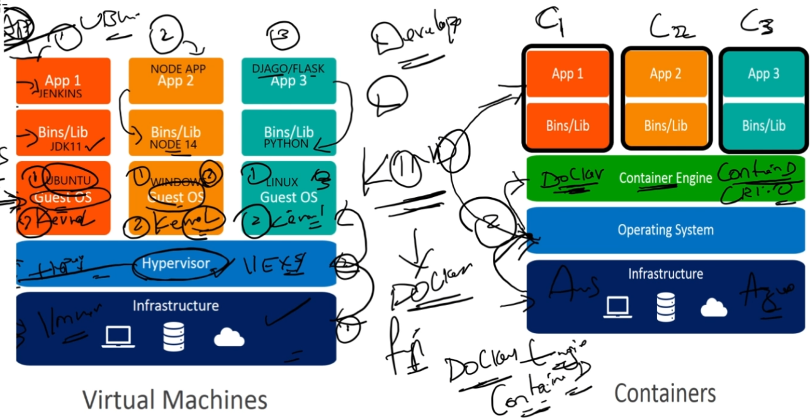
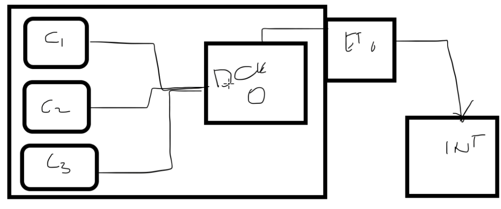

Hardware Components:
CPU: Central Processing Unit, the brain of the computer.
RAM: Random Access Memory, temporary storage for data being used.
HD: Hard Drive, permanent storage for data.
Graphic Cards: Hardware for rendering images and video.

Software Components:
Operating System: The main software that manages hardware and software resources.
Applications: Software you use, such as Zen Recorder for recording videos or games.

The Kernel:
The kernel is the core part of an operating system. It acts as a bridge between software and hardware, converting requests into instructions the hardware can understand.

Container Runtimes
There are several runtimes for running containers, including:
Container-D
Docker
CRI-O

# Note: In production environments, Container-D is typically used. Developers often use Docker for local testing. For example, KIND (Kubernetes IN Docker) is used to create Kubernetes clusters in Docker for testing.

# Container vs Virtual machines 

Virtual Machines (VMs) are like having a complete, separate computer within your computer. Each VM runs its own full operating system, like having another Windows or Linux inside your main system. Because they need to load an entire OS, VMs are big and take a while to start. They are very isolated from each other, making them secure, as each VM operates independently without knowing about the others.

Containers, on the other hand, are like small, self-contained environments inside your computer. They share the main computer’s operating system but have their own space for running applications. Containers are much smaller and start very quickly since they don’t need a full OS. They offer enough isolation to keep applications separate but are less isolated than VMs because they share the same OS.

----

# Docker Architecture 

Docker Client
What it is: The Docker client is like the command center for Docker. It’s where you type in commands to tell Docker what to do.
How it works: You use the Docker client to build, run, and manage Docker containers. It talks to the Docker daemon, which does the actual work.
Example commands: docker build, docker run, docker pull.
Docker Hub
What it is: Docker Hub is an online service where you can find and store Docker images.
How it works: It’s like an app store but for Docker images. You can download (“pull”) images others have created, or upload (“push”) your own images.
Usage: When you need an image to create a container, you can pull it from Docker Hub.
Docker Registry
What it is: A Docker registry is a place to store Docker images. Docker Hub is the most popular public registry, but you can also have private registries.
How it works: Registries stores the images you create and make them available for you to pull and run on your Docker client. Private registries are used for images you don’t want to share publicly.
Example: Companies often use private registries to store their internal application images securely.

# Installing Docker & Network changes 

curl https://get.docker.com/ | bash 

Netwrok : Bridge - Host - none

Bridge : A Docker bridge network is a private internal network created by Docker on the host machine. It's used to allow containers to communicate with each other within the same host.

# Listing namespaces & Running basic docker commands 

Basic Docker Commands

Check Docker version: - docker version

List namespaces: -  lsns

List PID namespaces:-    lsns -t pid

Run a container:-    docker run --name app1 nginx:latest

Run a container in the background: -    docker -d run --name app1 nginx:latest

Create multiple containers: -   for i in {1..10}; do docker run -d nginx:latest; done

List running containers:-    docker ps

Stop all containers: -  docker stop $(docker ps -aq)
Add alias dstop='docker stop $(docker stop -aq)' under the .bashrc, then enter source .bashrc

Remove all stopped container: docker rm $(docker ps -aq)
Add alias sremove='docker rm $(docker stop -aq)' under the .bashrc, then enter source .bashrc

removed the comatiner if stopped with flag --rm

Deploy and remove containers: docker run --rm -d --name app1 nginx:latest

Deploy and restart containers if stopped: - docker run --restart always -d --name app1 nginx:latest

Inspect a container: docker inspect app1
    here , we can see that  "IPAddress": "172.17.0.2",/ "IPAddress": "172.17.0.3",  "IPAddress": "172.17.0.4. so, first network  "IPAddress": "172.17.0.1 is used by "docker0"
    verify: ifconfig

Port forwarding: docker run --rm -d --name app1 -p 8000:80 nginx:latest
View logs: -    docker logs app1 -f
  - cd  /var/lib/docker/containers/
  - ls -al
  - cd container_id
  - cat -json.log (actual logs of conatainer) | jq

Commands:
  attach      Attach local standard input, output, and error streams to a running container
  commit      Create a new image from a container's changes
  cp          Copy files/folders between a container and the local filesystem
  create      Create a new container
  diff        Inspect changes to files or directories on a container's filesystem
  events      Get real time events from the server
  export      Export a container's filesystem as a tar archive
  history     Show the history of an image
  import      Import the contents from a tarball to create a filesystem image
  inspect     Return low-level information on Docker objects
  kill        Kill one or more running containers
  load        Load an image from a tar archive or STDIN
  logs        Fetch the logs of a container
  pause       Pause all processes within one or more containers
  port        List port mappings or a specific mapping for the container
  rename      Rename a container
  restart     Restart one or more containers
  rm          Remove one or more containers
  rmi         Remove one or more images
  save        Save one or more images to a tar archive (streamed to STDOUT by default)
  start       Start one or more stopped containers
  stats       Display a live stream of container(s) resource usage statistics
  stop        Stop one or more running containers
  tag         Create a tag TARGET_IMAGE that refers to SOURCE_IMAGE
  top         Display the running processes of a container
  unpause     Unpause all processes within one or more containers
  update      Update configuration of one or more containers
  wait        Block until one or more containers stop, then print their exit codes

 Run 'docker COMMAND --help' for more information on a command. 

   
