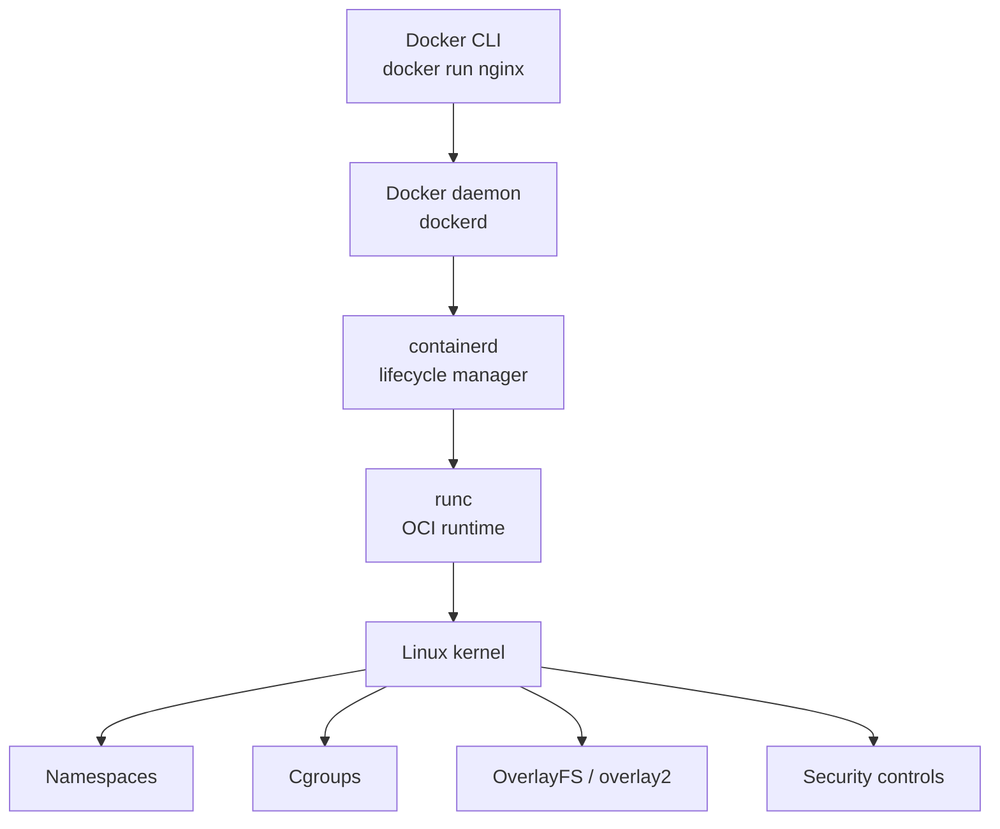
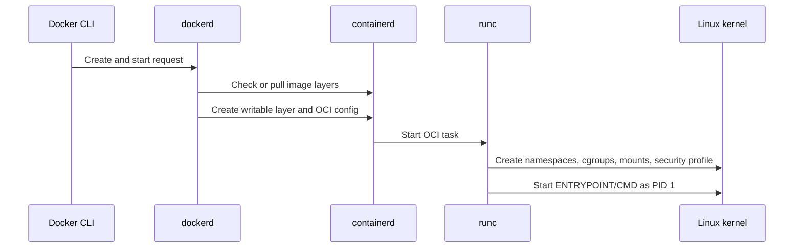
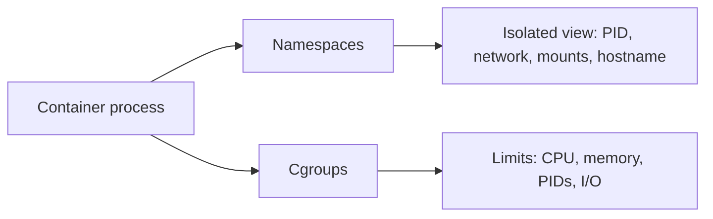

# Docker Fundamentals

## Hardware Components

- **CPU (Central Processing Unit)** – The brain of the computer that executes instructions.
- **RAM (Random Access Memory)** – Temporary memory used by running applications.
- **Hard Disk (HDD/SSD)** – Permanent storage for files and operating systems.
- **Graphics Card (GPU)** – Hardware responsible for rendering graphics and videos.

---

## Software Components

- **Operating System (OS)** – Manages hardware resources and provides services to applications.
- **Applications** – Programs such as web browsers, IDEs, games, or tools like Zen Recorder.

---

# The Linux Kernel

The **kernel** is the core component of an operating system.

It acts as a bridge between software and hardware by:

- Managing CPU and memory
- Managing devices
- Handling system calls
- Converting application requests into hardware instructions

```
Application
      │
      ▼
   Linux Kernel
      │
      ▼
 Hardware (CPU, RAM, Disk, Network)
```

---

# Container Runtimes

Popular container runtimes include:

- Docker
- containerd
- CRI-O

> **Production:** Most Kubernetes clusters use **containerd**.
>
> **Development:** Developers commonly use **Docker** for building and testing containers.

### Example

**KIND (Kubernetes IN Docker)** creates Kubernetes clusters inside Docker containers for local development.

---

# Containers vs Virtual Machines

| Virtual Machines | Containers |
|------------------|------------|
| Runs a full operating system | Shares the host OS kernel |
| Large in size | Lightweight |
| Slow startup | Fast startup |
| Strong isolation | Process-level isolation |
| Higher resource usage | Lower resource usage |
| Suitable for multiple OSes | Suitable for microservices |

### Virtual Machines

- Includes a complete guest operating system
- Uses a hypervisor
- More secure isolation
- Higher CPU and memory consumption

### Containers

- Share the host kernel
- Package only the application and dependencies
- Start in seconds
- Ideal for cloud-native applications

---

# Docker Architecture

```
              Docker Client
          (docker commands)
                    │
                    ▼
             Docker Daemon
                    │
        ┌───────────┴───────────┐
        ▼                       ▼
 Docker Images            Docker Containers
        │
        ▼
 Docker Registry (Docker Hub / Private Registry)
```

---

## Docker Client

The Docker client is the command-line interface used to communicate with Docker.

Common commands:

```bash
docker build
docker run
docker pull
docker push
docker ps
```

---

## Docker Daemon

The Docker daemon performs all Docker operations, including:

- Building images
- Running containers
- Managing networks
- Managing volumes

---

## Docker Hub

Docker Hub is the default public registry used to:

- Pull images
- Push images
- Share container images

Example:

```bash
docker pull nginx
```

---

## Docker Registry

A Docker registry stores Docker images.

Examples:

- Docker Hub (Public)
- Harbor
- AWS ECR
- Google Artifact Registry
- Azure Container Registry

Organizations commonly use **private registries** to securely store internal images.

---

# Installing Docker

Install Docker on Linux:

```bash
curl -fsSL https://get.docker.com | bash
```

Verify installation:

```bash
docker version
docker info
```

---

# Docker Networking

Docker provides several networking modes.

## Bridge Network (Default)

- Default Docker network
- Containers communicate using private IP addresses
- Internet access through NAT

```
Container A
      │
      │
Container B
      │
      ▼
 docker0 Bridge
      │
      ▼
 Host Machine
```

---

## Host Network

- Container shares the host's network stack.
- No separate IP address is assigned.

---

## None Network

- No networking.
- Completely isolated container.

---

# Linux Namespaces

List all namespaces:

```bash
lsns
```

List only PID namespaces:

```bash
lsns -t pid
```

---

# Basic Docker Commands

## Check Docker Version

```bash
docker version
```

---

## Run a Container

```bash
docker run --name app1 nginx:latest
```

---

## Run in Detached Mode

```bash
docker run -d --name app1 nginx:latest
```

---

## Create Multiple Containers

```bash
for i in {1..10}; do
    docker run -d nginx:latest
done
```

---

## List Running Containers

```bash
docker ps
```

List all containers:

```bash
docker ps -a
```

---

## Stop All Containers

```bash
docker stop $(docker ps -aq)
```

---

## Remove All Containers

```bash
docker rm $(docker ps -aq)
```

---

## Automatically Remove Container After Exit

```bash
docker run --rm nginx
```

---

## Deploy a Temporary Container

```bash
docker run --rm -d --name app1 nginx:latest
```

---

## Restart Policy

Always restart if the container exits.

```bash
docker run \
--restart always \
-d \
--name app1 \
nginx:latest
```

---

# Docker Aliases

Add these to your `~/.bashrc`.

```bash
alias dstop='docker stop $(docker ps -aq)'
alias dremove='docker rm $(docker ps -aq)'
```

Reload Bash:

```bash
source ~/.bashrc
```

---

# Inspect a Container

```bash
docker inspect app1
```

Example output:

```json
"IPAddress": "172.17.0.2"
```

Typical bridge network:

```
docker0      → 172.17.0.1
Container 1  → 172.17.0.2
Container 2  → 172.17.0.3
Container 3  → 172.17.0.4
```

Verify bridge interface:

```bash
ifconfig
```

or

```bash
ip addr
```

---

# Port Mapping

Expose container port 80 on host port 8000.

```bash
docker run \
-d \
--rm \
--name app1 \
-p 8000:80 \
nginx
```

Access:

```
http://localhost:8000
```

---

# View Container Logs

```bash
docker logs app1
```

Follow logs:

```bash
docker logs -f app1
```

---

# Docker Log Files

Docker stores logs at:

```bash
cd /var/lib/docker/containers
```

List container directories:

```bash
ls -al
```

View log file:

```bash
cat <container-id>-json.log | jq
```

---

# Common Docker Commands

| Command | Description |
|----------|-------------|
| `docker attach` | Attach to a running container |
| `docker commit` | Create an image from a container |
| `docker cp` | Copy files between host and container |
| `docker create` | Create a container without starting it |
| `docker diff` | Show filesystem changes |
| `docker events` | View real-time Docker events |
| `docker export` | Export a container as a tar archive |
| `docker history` | Show image history |
| `docker import` | Import an image from a tar file |
| `docker inspect` | Display detailed object information |
| `docker kill` | Force stop a container |
| `docker load` | Load an image from a tar archive |
| `docker logs` | Display container logs |
| `docker pause` | Pause all processes in a container |
| `docker port` | Show port mappings |
| `docker rename` | Rename a container |
| `docker restart` | Restart a container |
| `docker rm` | Remove container(s) |
| `docker rmi` | Remove image(s) |
| `docker save` | Save an image to a tar archive |
| `docker start` | Start stopped container(s) |
| `docker stats` | Live resource usage |
| `docker stop` | Stop running container(s) |
| `docker tag` | Tag an image |
| `docker top` | Display running processes |
| `docker unpause` | Resume paused container |
| `docker update` | Update container configuration |
| `docker wait` | Wait until a container exits |

---

# Getting Help

For detailed help on any Docker command:

```bash
docker COMMAND --help
```

Example:

```bash
docker run --help
docker build --help
docker network --help
```

---

# Docker Internals: Processes, Isolation, and Security

## The Core Idea

Docker containers are normal host processes with Linux kernel features applied
around them; they are not lightweight virtual machines.

- **Namespaces** isolate what a process can see.
- **Cgroups** limit and account for what it can use.
- **Union filesystems** provide its layered filesystem.
- **Capabilities**, **seccomp**, and **AppArmor/SELinux** reduce privileges.

> Namespaces isolate visibility; cgroups limit resource usage.

## Docker Architecture Internals


```mermaid
flowchart TD
    A[Docker CLI<br/>docker run nginx] --> B[Docker daemon<br/>dockerd]
    B --> C[containerd<br/>lifecycle manager]
    C --> D[runc<br/>OCI runtime]
    D --> E[Linux kernel]
    E --> F[Namespaces]
    E --> G[Cgroups]
    E --> H[OverlayFS / overlay2]
    E --> I[Security controls]
```

- The **CLI** sends API requests to `dockerd`.
- **dockerd** manages images, containers, networks, and volumes.
- **containerd** manages image pulls, snapshots, and container lifecycle.
- **runc** creates the isolated process from an OCI runtime specification.
- The **Linux kernel** provides the actual controls.

## What Happens During `docker run nginx`

`docker run` is roughly `docker create` followed by `docker start`.


```mermaid
sequenceDiagram
    participant CLI as Docker CLI
    participant Daemon as dockerd
    participant Containerd as containerd
    participant Runtime as runc
    participant Kernel as Linux kernel
    CLI->>Daemon: Create and start request
    Daemon->>Containerd: Check or pull image layers
    Daemon->>Containerd: Create writable layer and OCI config
    Containerd->>Runtime: Start OCI task
    Runtime->>Kernel: Create namespaces, cgroups, mounts, security profile
    Runtime->>Kernel: Start ENTRYPOINT/CMD as PID 1
```

1. Docker finds or pulls image layers, then adds a thin writable layer.
2. Docker prepares the OCI runtime specification and networking.
3. `runc` asks the kernel to apply namespaces, cgroups, mounts, and security.
4. The image `ENTRYPOINT` or `CMD` starts as PID 1 in the container.

## Namespaces and Cgroups

| Namespace | What it isolates | Example |
| --- | --- | --- |
| PID | Process IDs | Application sees itself as PID 1 |
| NET | Network stack | Own interfaces, routes, and ports |
| MNT | Mount points | Own root filesystem view |
| UTS | Hostname/domain name | Own hostname |
| IPC | Shared memory and queues | Isolated IPC |
| USER | User and group IDs | Root can map to an unprivileged host user |
| CGROUP | Cgroup view | Own cgroup hierarchy view |

```bash
docker run --memory=512m --cpus=1 nginx
```


```mermaid
flowchart LR
    A[Container process] --> B[Namespaces]
    A --> C[Cgroups]
    B --> D[Isolated view: PID, network, mounts, hostname]
    C --> E[Limits: CPU, memory, PIDs, I/O]
```

A process can be PID 1 inside its container while having a different normal PID on the host.

## Security Fundamentals

Containers share the host kernel, so they are not a full VM-grade security
boundary. Docker layers namespaces and cgroups with capabilities, seccomp,
AppArmor or SELinux, user namespaces, and optional read-only root filesystems.

Avoid `--privileged` unless essential: it grants broad capabilities and device access.

```bash
docker run --read-only nginx
docker run --cap-drop=ALL --cap-add=NET_BIND_SERVICE nginx
docker run --user 1000:1000 node:20
```

## Containers vs Virtual Machines

| Topic | Container | Virtual machine |
| --- | --- | --- |
| Isolation | OS/process-level | Hardware virtualization |
| Kernel | Shares host kernel | Guest OS kernel |
| Startup and size | Usually faster and smaller | Usually slower and larger |
| Boundary strength | Good, but shared kernel | Stronger isolation |

## PID 1 and Interview Review

When PID 1 exits, the container exits. PID 1 also handles signals differently
and should reap child processes; applications that do not do this may use `tini`.

- An **image** is a read-only layered template; a **container** is its running instance with a writable layer.
- Docker uses namespaces for isolation, cgroups for resource control, and filesystem and security controls around the process.

```text
CLI -> dockerd -> containerd -> runc -> Linux kernel
namespaces = what the container can see
cgroups = what the container can use
overlay2 = layered container filesystem
veth + docker0 + NAT = common bridge networking path
volumes = persistent data outside container lifecycle
```
