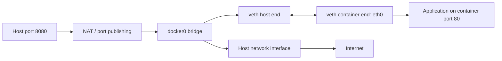

1. docker default directory chnage.
2. Attach EBS volume to docker for storing dockerdata
3. Custom network for container name communication.

# Why We Need Separate Utilization for Docker Data
The default directory for Docker is /var/lib/docker. As you continue downloading images and generating logs, this directory will consume more space and eventually get busy. To prevent this, we can store all our Docker data in a separate directory.

# Steps To Create EBS Volume and Attaching it to the instance
Create EBS volume GP3 and atatch it to Instance

lsblk 
!https://devopscube.com/mount-ebs-volume-ec2-instance/

    mkdir /docker_data 

# Why We Need a Custom Network for Containers

With the default bridge network, containers can communicate with each other using IP addresses but not with container names. To enable communication using container names, we need to create a custom network.

First create a customer network 

    Docker network create custom-bridge --driver bridge

    Docker network inspect custom-bridge

Now run containers with including the custom network

    docker run –rm -d –name app3 -p 8001 –-network custom-bridge  shakil1602/troubleshootingtools:v1

    docker run –rm -d –name app4 -p 8002 –-network custom-bridge  shakil1602/troubleshootingtools:v1

If you login to the container with docker exec -it containername bash and you can ping with the container name instead of IP, It should work. 
docker network connect app1 custom-bridge
login to app3 and ping app1.

# Using the HOST Network Mode

The HOST network mode means the container shares the host's IP address. This eliminates the need for port forwarding when running the container. For example, when using Prometheus with Node Exporter, it utilizes the host IP for metric collection, making it easier to access the metrics.

Example Command

    docker run --rm -d --name node-exporter --network host prom/node-exporter

You can access the Node Exporter from the host's public IP on port 9100. To inspect the Docker image and understand the default settings, use the following command:

    docker image inspect prom/node-exporter:latest

# Using the NONE Network Mode

The NONE network mode means the container has no network interfaces enabled except for a loopback device. This is useful for highly isolated containers that do not require any network access.

Example Command

    docker run --rm -d --name isolated-container --network none busybox

This command runs a BusyBox container with no network connectivity, providing complete network isolation.

---

# Docker Networking Internals

The default Docker network mode is usually **bridge**. Docker gives a bridge container its own network namespace, then connects it to the host with a virtual Ethernet pair (**veth pair**).

1. One veth end is placed in the container as `eth0`.
2. The host end connects to the `docker0` Linux bridge.
3. Docker configures NAT so containers can reach external networks.
4. Published ports forward host traffic to the container port.



```bash
docker run -p 8080:80 nginx
```

This maps `host:8080` to `container:80`. The container has its own network stack, while Docker's host-side networking rules deliver published traffic.

## Network Modes

| Mode | Meaning |
| --- | --- |
| `bridge` | Default private network for containers on one host |
| `host` | Container shares the host network namespace |
| `none` | No network except loopback |
| `overlay` | Multi-host network, commonly used by orchestrators |
| `macvlan` | Container appears as a device on the physical LAN |

> Bridge networking commonly uses a container network namespace, veth pair, `docker0` bridge, and NAT/port-publishing rules.


