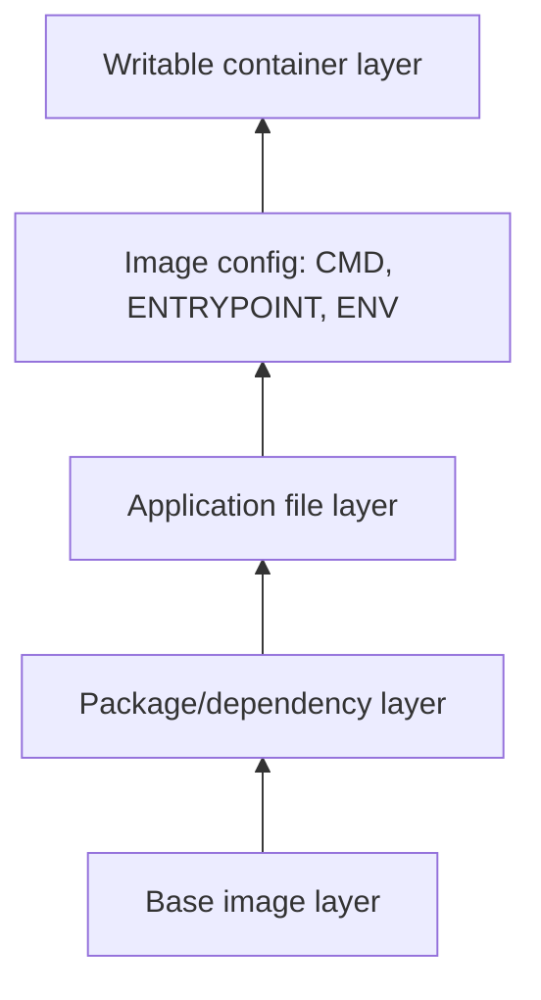
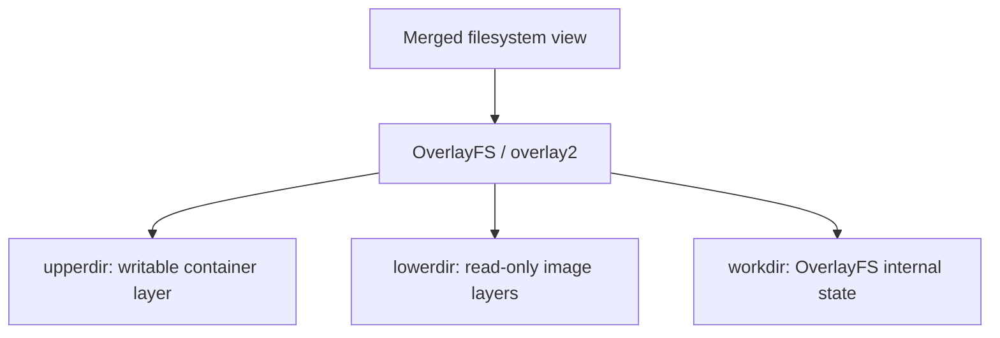

# Dockerfile Part 01

This guide explains how to build a custom Docker image using an **Ubuntu** base image with **Terraform**, **Packer**, and **Nginx** installed. It also covers common Docker build and runtime commands.

---

# Objectives

In this chapter, you will learn how to:

- Create your first Dockerfile
- Build a custom Docker image
- Install software during image creation
- Use `ARG` and `ENV`
- Run and inspect containers
- Pass environment variables
- Tag and push images to Docker Hub
- Understand common Dockerfile instructions

---

# Project Structure

```text
.
├── Dockerfile
└── README.md
```

---

# Dockerfile

> **Note:** This is an improved version of the original Dockerfile that follows Docker best practices.

```dockerfile
FROM ubuntu:latest

LABEL maintainer="SHAKIL"

ARG T_VERSION=1.6.6
ARG P_VERSION=1.8.0

ENV AWS_DEFAULT_REGION=us-east-1

RUN apt-get update && \
    apt-get install -y --no-install-recommends \
        curl \
        wget \
        unzip \
        jq \
        net-tools \
        nginx \
        iputils-ping && \
    rm -rf /var/lib/apt/lists/*

RUN wget -q https://releases.hashicorp.com/terraform/${T_VERSION}/terraform_${T_VERSION}_linux_amd64.zip && \
    wget -q https://releases.hashicorp.com/packer/${P_VERSION}/packer_${P_VERSION}_linux_amd64.zip && \
    unzip terraform_${T_VERSION}_linux_amd64.zip && \
    unzip packer_${P_VERSION}_linux_amd64.zip && \
    mv terraform /usr/local/bin/ && \
    mv packer /usr/local/bin/ && \
    chmod +x /usr/local/bin/terraform /usr/local/bin/packer && \
    terraform version && \
    packer version && \
    rm -f *.zip

EXPOSE 80

CMD ["nginx", "-g", "daemon off;"]
```

---

# Dockerfile Overview

This Dockerfile performs the following tasks:

1. Uses **Ubuntu** as the base image.
2. Installs common networking and utility tools.
3. Downloads Terraform and Packer.
4. Places the binaries in `/usr/local/bin`.
5. Starts **Nginx** in the foreground.

---

# Build the Docker Image

Build the image using the default Dockerfile.

```bash
docker build -t your_image_name:v1 .
```

Example:

```bash
docker build -t shakil1602/custom-nginx:v1 .
```

---

# Build Without Cache

Ignore all cached image layers.

```bash
docker build \
--no-cache \
-t shakil1602/custom-nginx:v1 .
```

---

# Build Using Another Dockerfile

```bash
docker build \
-f dockerfile.dev \
-t shakil1602/custom-nginx:v1 .
```

---

# Build with Build Arguments

Override Terraform and Packer versions during build.

```bash
docker build \
--build-arg T_VERSION=1.5.0 \
--build-arg P_VERSION=1.5.0 \
-t your_image_name:v2 .
```

Example:

```bash
docker build \
--build-arg T_VERSION=1.5.0 \
--build-arg P_VERSION=1.5.0 \
--no-cache \
-f dockerfile.dev \
-t shakil1602/custom-nginx:v2 .
```

---

# Build with Plain Progress

Useful for debugging build steps.

```bash
docker build \
--progress=plain \
-t your_image_name:v1 .
```

---

# Run the Container

```bash
docker run \
-d \
--rm \
--name app1 \
shakil1602/custom-nginx:v1
```

---

# Open a Shell Inside the Container

```bash
docker exec -it app1 bash
```

---

# Verify Installed Software

Terraform version:

```bash
terraform version
```

Packer version:

```bash
packer version
```

Nginx version:

```bash
nginx -v
```

---

# Run Container Interactively

```bash
docker run -it your_image_name:v1 /bin/bash
```

Example:

```bash
docker run -it shakil1602/custom-nginx:v1 /bin/bash
```

---

# Pass Environment Variables

Environment variables can be supplied when the container starts.

```bash
docker run \
-p 80:80 \
-e AWS_ACCESS_KEY_ID=YOUR_KEY \
-e AWS_SECRET_ACCESS_KEY=YOUR_SECRET \
-e AWS_DEFAULT_REGION=us-east-1 \
your_image_name:v1
```

Example:

```bash
docker run \
-d \
--rm \
--name app5 \
-p 80:80 \
-e AWS_ACCESS_KEY_ID=hidden \
-e AWS_SECRET_ACCESS_KEY=hidden \
-e AWS_DEFAULT_REGION=us-east-1 \
shakil1602/custom-nginx:v1
```

---

# Verify Environment Variables

```bash
docker exec -it app5 env
```

Compare with another container:

```bash
docker exec -it app1 env
```

---

# Add a New Image Tag

```bash
docker tag your_image_name:v1 your_image_name:latest
```

Example:

```bash
docker tag \
shakil1602/custom-nginx:v1 \
shakil1602/custom-nginx:latest
```

---

# Push Image to Docker Hub

Login:

```bash
docker login
```

Push:

```bash
docker push shakil1602/custom-nginx:v1
```

---

# View Image History

Display every image layer.

```bash
docker history your_image_name:v1
```

Example:

```bash
docker history shakil1602/custom-nginx:v1
```

This helps you understand:

- Layer size
- Build commands
- Image optimization opportunities

---

# Docker System Cleanup

Remove unused resources.

```bash
docker system prune
```

Remove everything, including unused volumes.

```bash
docker system prune -a --volumes
```

This removes:

- Stopped containers
- Dangling images
- Unused networks
- Build cache
- Unused volumes (with `--volumes`)

---

# Common Dockerfile Instructions

## FROM

Defines the base image.

```dockerfile
FROM ubuntu:24.04
```

Every Dockerfile starts with a `FROM` instruction.

---

## LABEL

Adds metadata to the image.

```dockerfile
LABEL maintainer="Shakil"
```

View labels:

```bash
docker inspect IMAGE_NAME
```

---

## ARG

Defines a build-time variable.

```dockerfile
ARG VERSION=1.6.6
```

Used only during image build.

Example:

```bash
docker build --build-arg VERSION=1.7.0 .
```

---

## ENV

Defines runtime environment variables.

```dockerfile
ENV APP_ENV=production
```

Accessible inside the container.

```bash
echo $APP_ENV
```

---

## RUN

Executes commands while building the image.

```dockerfile
RUN apt-get update
```

Each `RUN` creates a new image layer.

---

## COPY

Copies local files into the image.

```dockerfile
COPY app/ /app/
```

Does **not** extract archives.

---

## ADD

Copies files like `COPY` but can also:

- Extract local archives automatically
- Download files from URLs (not generally recommended)

```dockerfile
ADD app.tar.gz /app/
```

For most use cases, **COPY is preferred**.

---

## WORKDIR

Sets the working directory.

```dockerfile
WORKDIR /app
```

Subsequent commands execute from this directory.

---

## EXPOSE

Documents the application's listening port.

```dockerfile
EXPOSE 80
```

---

## CMD

Specifies the default command.

```dockerfile
CMD ["nginx","-g","daemon off;"]
```

Can be overridden at runtime.

---

## ENTRYPOINT

Defines the executable that always runs.

```dockerfile
ENTRYPOINT ["terraform"]
```

Example:

```bash
docker run myimage version
```

Docker executes:

```bash
terraform version
```

---

# CMD vs ENTRYPOINT

| CMD | ENTRYPOINT |
|------|------------|
| Default command | Main executable |
| Easily overridden | Always executed |
| One per Dockerfile | One per Dockerfile |
| Often used with applications | Often used for CLI tools |

Example:

```dockerfile
ENTRYPOINT ["terraform"]
CMD ["version"]
```

Running:

```bash
docker run myimage
```

executes:

```bash
terraform version
```

Running:

```bash
docker run myimage fmt
```

executes:

```bash
terraform fmt
```

---

# Best Practices

- ✅ Keep images as small as possible.
- ✅ Combine related `RUN` commands to reduce image layers.
- ✅ Remove package caches after installation.
- ✅ Use `COPY` instead of `ADD` unless archive extraction is needed.
- ✅ Never hardcode passwords or cloud credentials in a Dockerfile.
- ✅ Use `ARG` for build-time configuration.
- ✅ Use `ENV` only for non-sensitive runtime configuration.
- ✅ Tag images with meaningful versions instead of relying only on `latest`.

# Image Layers and OverlayFS

A Docker image is a stack of read-only filesystem layers. Dockerfile instructions such as `RUN` and `COPY` commonly create layers; image configuration stores details such as `CMD`, `ENTRYPOINT`, and environment values. Starting a container adds a thin writable layer above them.



## Copy-on-Write

When a container changes a file from a read-only image layer, Docker copies it into the writable container layer first. The image layers stay unchanged. This is **copy-on-write**.

On Linux, Docker commonly uses the `overlay2` storage driver, based on OverlayFS:

| OverlayFS directory | Purpose |
| --- | --- |
| `lowerdir` | Read-only image layers |
| `upperdir` | Writable container layer |
| `merged` | Unified view seen inside the container |
| `workdir` | OverlayFS internal working area |



> Images are immutable layered templates; a running container adds a writable layer on top.
