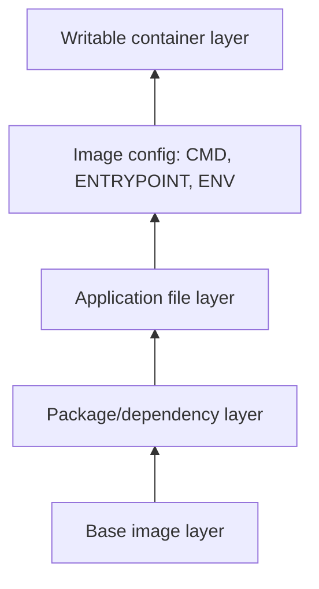
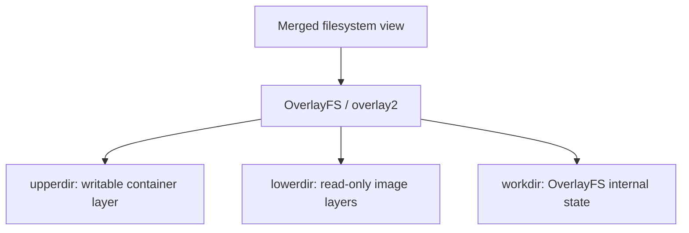

# Docker File part 01

This repository contains a Dockerfile for setting up an environment with Terraform and Packer on an Ubuntu base image. Below are the steps and commands used in the Dockerfile and for running the container.

## Dockerfile Overview

The Dockerfile performs the following tasks:
1. Sets up an Ubuntu base image.
2. Installs necessary tools (jq, net-tools, curl, wget, unzip, nginx, iputils-ping).
3. Downloads and installs specific versions of Terraform and Packer.
4. Runs nginx in the foreground.

### Dockerfile Contents

FROM ubuntu:latest

LABEL name="SHAKIL"

ENV AWS_ACCESS_KEY_ID=XXXXXXXXXXX \
    AWS_SECRET_KEY_ID=XXXXXXXXXXX \
    AWS_DEFAULT_REGION=US-EAST-1A

ARG T_VERSION='1.6.6' \
    P_VERSION='1.8.0'

RUN apt update && apt install -y jq net-tools curl wget unzip \
    && apt install -y nginx iputils-ping 

RUN wget https://releases.hashicorp.com/terraform/${T_VERSION}/terraform_${T_VERSION}_linux_amd64.zip \
    && wget https://releases.hashicorp.com/packer/${P_VERSION}/packer_${P_VERSION}_linux_amd64.zip \
    && unzip terraform_${T_VERSION}_linux_amd64.zip  && unzip packer_${P_VERSION}_linux_amd64.zip \
    && chmod 777 terraform && chmod 777 packer \
    && ./terraform version && ./packer version 

CMD ["nginx", "-g", "daemon off;"]

## Docker Commands

### Building the Docker Image

To build the Docker image with a specific name and tag:

    docker build -t your_image_name:v3 .

To build the Docker image without using the cache:

    docker build -t --no-cache shakil16/custom-nginx:v1 -f dockerfile.dev .
Run the conatiner:
    docker run --rm -d --name app1 shakil16/custom-nginx:v1
login into the container:
    docker exec -it app bash
check the terraform and packer version
    ./terraform version
    ./packer version

To pass build arguments for Terraform and Packer versions:

    docker build --build-arg T_VERSION=1.5.0 --build-arg P_VERSION=1.5.0 -t your_image_name:v3 .
    docker build --build-arg T_VERSION=1.5.0 --build-arg P_VERSION=1.5.0 --no-cache -t
    shakil16/custom-nginx:v2 -f dockerfile.dev .

To build the Docker image with plain progress output:

    docker build --progress=plain -t your_image_name:v3 .

### Running the Container

To run the container and check the versions of Terraform and Packer:

    docker run -it your_image_name:v3 /bin/bash
    docker run -it shakil16/custom-nginx:v2 /bin/bash
    ./terraform version
    ./packer version

### Setting Environment Variables

To pass environment variables when running the container:

    docker run -p 80:80 -e AWS_ACCESS_KEY_ID=your_access_key -e AWS_SECRET_KEY_ID=your_secret_key -e AWS_DEFAULT_REGION=your_region your_image_name:v3
    docker run --rm -d -p 80:80 --name app5 -e AWS_ACCESS_KEY_ID=hidden -e AWS_secret_KEY_ID=hidden shakil16/custom-nginx:v2
check the env of both container
    docker exec -it app5 env
    docker exec -it app1 env

## Useful Docker Commands

### Adding a Tag

To add a tag to an existing image:

    docker tag your_image_name:v3 your_image_name:latest
    docker tag shakil16/custom-nginx:v1 shakil1602/custom-nginx:v1
    docker login
    docker push shakil1602/custom-nginx:v1

### Docker History

To check the history of the Docker image:

    docker history your_image_name:v3
    docker history shakil16/custom-nginx:v1

All stopped containers
All networks not used by at least one container
All dangling images
Anused build cache
    docker system prune  

## Dockerfile Instructions Explained

- **ADD**: Adds files from your host system to the image. Useful for adding archives which need to be extracted.
- **COPY**: Copies files from your host system to the image. Used for copying local files and directories.
- **ENTRYPOINT**: Configures a container to run as an executable.
- **WORKDIR**: Sets the working directory inside the image where subsequent commands will be run from.

---

# Image Layers and OverlayFS

A Docker image is a stack of read-only filesystem layers. Dockerfile instructions such as `RUN` and `COPY` commonly create layers; image configuration stores details such as `CMD`, `ENTRYPOINT`, and environment values. Starting a container adds a thin writable layer above them.

## Copy-on-Write

When a container changes a file from a read-only image layer, Docker copies it into the writable container layer first. The image layers stay unchanged. This is **copy-on-write**.

On Linux, Docker commonly uses the `overlay2` storage driver, based on OverlayFS:

| OverlayFS directory | Purpose |
| --- | --- |
| `lowerdir` | Read-only image layers |
| `upperdir` | Writable container layer |
| `merged` | Unified view seen inside the container |
| `workdir` | OverlayFS internal working area |

> Images are immutable layered templates; a running container adds a writable layer on top.
