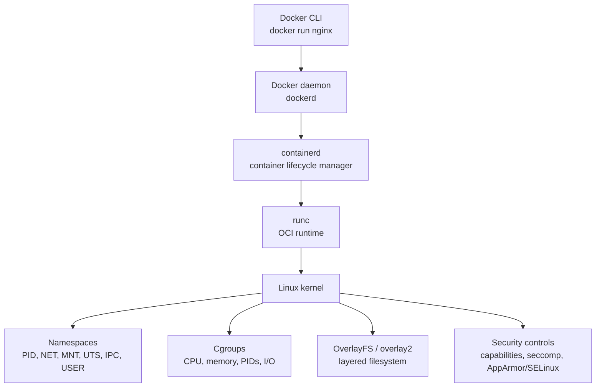
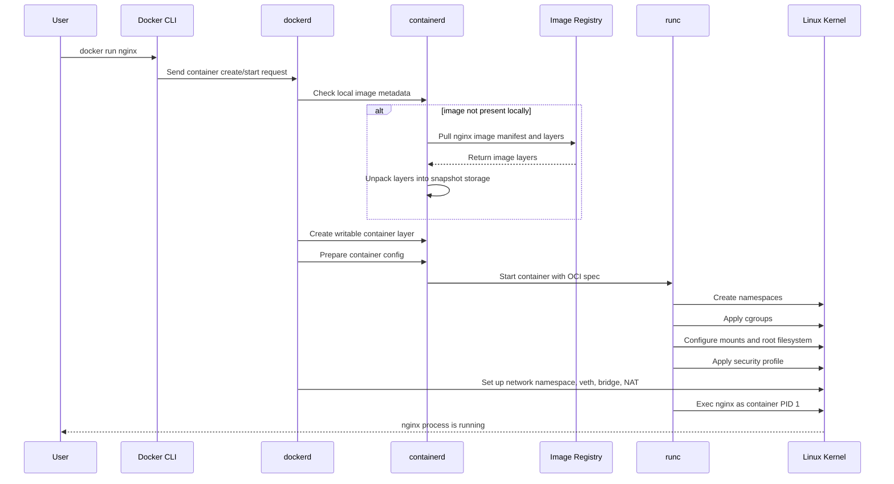
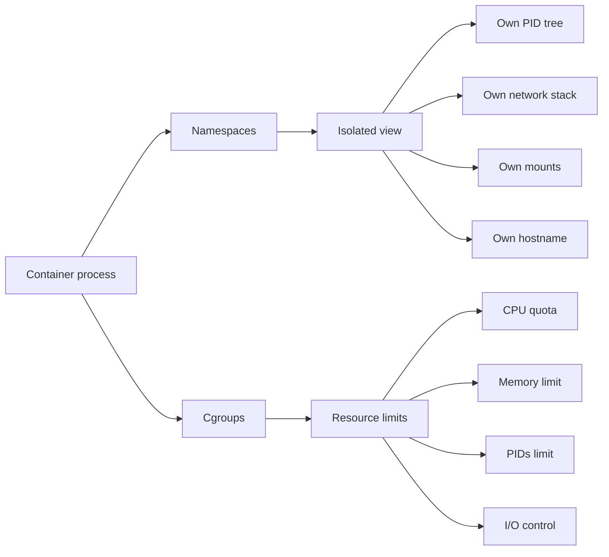
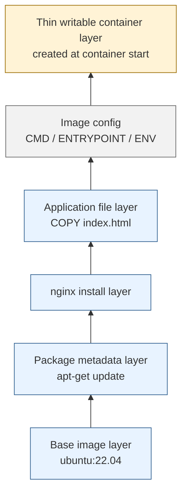
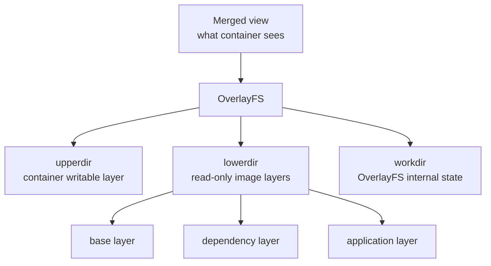
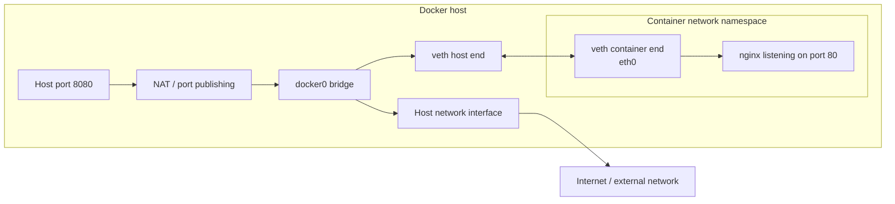

# Docker Internals Interview Notes

This guide is for interview preparation. It focuses on what Docker does underneath the commands: how containers are created, isolated, limited, networked, stored, and secured.

## The Core Idea

Docker containers are not lightweight virtual machines. A container is a normal process running on the host, but with Linux kernel features applied around it.

Docker mainly uses:

- **namespaces** to isolate what the process can see
- **cgroups** to limit what the process can use
- **union filesystems** such as OverlayFS to build layered filesystems
- **capabilities**, **seccomp**, and **LSM tools** such as AppArmor or SELinux for security controls

Strong interview line:

> Namespaces isolate visibility; cgroups limit resource usage.

## Docker Architecture

When you run a Docker command, the CLI is only the client. The actual container creation is delegated through several layers.



Main components:

- **Docker CLI** sends API requests.
- **dockerd** manages images, containers, networks, and volumes.
- **containerd** manages image pulls, container lifecycle, snapshots, and runtime tasks.
- **runc** is the low-level OCI runtime that creates the container process.
- **Linux kernel** provides the actual isolation and control primitives.

Interview answer:

> The Docker CLI talks to the Docker daemon. The daemon uses containerd for lifecycle management, and containerd uses runc to create the actual isolated process using Linux namespaces, cgroups, mounts, and security profiles.

## What Happens During `docker run nginx`

`docker run` is roughly `docker create` plus `docker start`.



Step-by-step:

1. Docker checks whether the image exists locally.
2. If missing, Docker pulls the image manifest and layers from a registry.
3. Image layers are unpacked into Docker's storage area.
4. Docker adds a thin writable container layer on top.
5. Docker prepares the OCI runtime spec.
6. `runc` creates the container process.
7. Kernel namespaces isolate the process view.
8. Cgroups apply resource accounting and limits.
9. Networking is configured.
10. The image `CMD` or `ENTRYPOINT` starts as PID 1 inside the container.

## Namespaces

Namespaces give a process an isolated view of the system.

| Namespace | What it isolates | Example |
| --- | --- | --- |
| PID | Process IDs | Container process can see itself as PID 1 |
| NET | Network stack | Container has its own interfaces, routes, and ports |
| MNT | Mount points | Container sees its own root filesystem |
| UTS | Hostname/domain name | Container can have its own hostname |
| IPC | Shared memory/message queues | Isolated inter-process communication |
| USER | User and group IDs | Container root can map to non-root host user |
| CGROUP | Cgroup view | Container sees its own cgroup hierarchy |

Important point:

> A process can be PID 1 inside the container while still having a different normal PID on the host.

## Cgroups

Cgroups control and account for resource usage.

They can limit or track:

- CPU usage
- memory usage
- process count
- block I/O
- device access

Example:

```bash
docker run --memory=512m --cpus=1 nginx
```

Interview answer:

> Namespaces decide what a container can see. Cgroups decide how much CPU, memory, I/O, and other resources it can consume.

## Isolation Flow



## Images, Layers, And Containers

A Docker image is made of read-only layers. Each Dockerfile instruction often creates a layer.

Example:

```dockerfile
FROM ubuntu:22.04
RUN apt-get update
RUN apt-get install -y nginx
COPY index.html /var/www/html/
CMD ["nginx", "-g", "daemon off;"]
```

Conceptually:



Key terms:

- **Image layer**: read-only filesystem changes from a build step.
- **Container layer**: thin writable layer added when a container starts.
- **Copy-on-write**: files from lower layers are copied to the writable layer only when modified.

Interview answer:

> Images are immutable, layered templates. A running container adds a writable layer on top of those read-only image layers.

## OverlayFS And `overlay2`

Docker commonly uses the `overlay2` storage driver on Linux.

OverlayFS combines:

- **lowerdir**: read-only image layers
- **upperdir**: writable container layer
- **merged**: the unified filesystem view visible inside the container
- **workdir**: internal working directory used by OverlayFS



Copy-on-write example:

1. A file exists in a read-only image layer.
2. The container modifies that file.
3. OverlayFS copies the file into the writable layer.
4. The modification happens in the writable layer.
5. The original image layer stays unchanged.

## Docker Networking Internals

The default Docker network mode is usually **bridge**.

When a container starts on the bridge network:

1. Docker creates a network namespace for the container.
2. Docker creates a virtual Ethernet pair, called a **veth pair**.
3. One end is placed inside the container as something like `eth0`.
4. The other end stays on the host and connects to the `docker0` bridge.
5. Docker configures NAT rules so the container can reach outside networks.
6. Published ports map host ports to container ports.



Example:

```bash
docker run -p 8080:80 nginx
```

Meaning:

```text
host:8080 -> container:80
```

Network modes:

| Mode | Meaning |
| --- | --- |
| bridge | Default single-host private network |
| host | Container shares the host network namespace |
| none | No network configured |
| overlay | Multi-host networking, common in orchestrated environments |
| macvlan | Container appears like a physical device on the LAN |

Interview answer:

> Docker bridge networking uses a container network namespace, a veth pair, the host's docker0 bridge, and NAT or port publishing rules to connect host traffic to container ports.

## Volumes, Bind Mounts, And Container Storage

The writable container layer is not ideal for persistent application data. Removing the container removes that writable layer.

Docker storage options:

| Type | Description | Best use |
| --- | --- | --- |
| Volume | Managed by Docker | Persistent database/app data |
| Bind mount | Maps a host path into a container | Local development |
| tmpfs mount | Memory-backed temporary storage | Sensitive or temporary data |

Volume example:

```bash
docker volume create pgdata
docker run -v pgdata:/var/lib/postgresql/data postgres:16
```

Bind mount example:

```bash
docker run -v C:\app:/app node:20
```

Interview answer:

> Volumes are managed independently from containers, so they are preferred for persistent data. Bind mounts are useful when you need direct access to a specific host directory, especially in development.

## Security Internals

Docker security is layered. A container is isolated, but it is not as strong a boundary as a full VM because it shares the host kernel.

Docker security mechanisms:

- **Namespaces** isolate views of the system.
- **Cgroups** limit resource usage.
- **Capabilities** split root privileges into smaller permissions.
- **seccomp** filters which syscalls a process can make.
- **AppArmor/SELinux** can enforce mandatory access control policies.
- **User namespaces** can map root inside the container to a less privileged host user.
- **Read-only root filesystem** can reduce write access.

Risky flag:

```bash
docker run --privileged ...
```

`--privileged` gives the container much broader host access, including many capabilities and device access. In interviews, call it powerful but dangerous.

Safer hardening examples:

```bash
docker run --read-only nginx
docker run --cap-drop=ALL --cap-add=NET_BIND_SERVICE nginx
docker run --user 1000:1000 node:20
```

Interview answer:

> Docker reduces container privileges with capabilities, seccomp, and Linux security modules, but containers still share the host kernel, so they should not be treated as full VM-grade isolation.

## Docker Build Cache

Docker builds images layer by layer. If a layer's inputs do not change, Docker can reuse the cached layer.

Better Node.js Dockerfile pattern:

```dockerfile
FROM node:20
WORKDIR /app
COPY package*.json ./
RUN npm install
COPY . .
EXPOSE 3000
CMD ["npm", "start"]
```

Why this is good:

- `package*.json` is copied first.
- `npm install` is cached until dependencies change.
- Application source changes do not always force dependency reinstall.

Interview answer:

> Docker cache works layer by layer. Once a layer changes, that layer and following layers usually need to be rebuilt.

## `CMD` vs `ENTRYPOINT`

| Instruction | Purpose |
| --- | --- |
| `CMD` | Default command or default arguments |
| `ENTRYPOINT` | Main executable the container is meant to run |

Example:

```dockerfile
ENTRYPOINT ["python"]
CMD ["app.py"]
```

Together this runs:

```bash
python app.py
```

Interview answer:

> `ENTRYPOINT` defines the main executable. `CMD` provides default arguments or a default command that can be overridden more easily.

## Docker vs Virtual Machine

| Topic | Container | Virtual Machine |
| --- | --- | --- |
| Isolation level | OS/process-level isolation | Hardware virtualization |
| Kernel | Shares host kernel | Has guest OS kernel |
| Startup | Usually fast | Usually slower |
| Size | Usually smaller | Usually larger |
| Boundary strength | Good, but shares kernel | Stronger isolation boundary |
| Best use | Packaging and running apps | Running different OS kernels or stronger isolation |

Interview answer:

> Containers share the host kernel and isolate processes using kernel features. Virtual machines virtualize hardware and run a full guest operating system.

## Common Interview Questions

### Is Docker a VM?

No. Docker uses OS-level virtualization. Containers share the host kernel and run as isolated processes.

### What is the difference between an image and a container?

An image is a read-only layered template. A container is a running instance of an image with a writable layer.

### What happens when a container exits?

The main process stops. The container remains in an exited state with its metadata and writable layer until it is removed.

### Why does a container stop when PID 1 exits?

The container lifecycle is tied to its main process. When the process running as PID 1 inside the container exits, the container exits.

### What is special about PID 1?

PID 1 handles signals differently and is responsible for reaping child processes. Some containers use an init process such as `tini` to handle this correctly.

### How does Docker isolate containers?

Docker uses namespaces for isolation, cgroups for resource controls, filesystem layering for container root filesystems, and security tools such as capabilities, seccomp, AppArmor, or SELinux.

### What is copy-on-write?

Copy-on-write means a file from a read-only image layer is copied into the writable container layer only when the container modifies it.

### What is `overlay2`?

`overlay2` is a Docker storage driver based on OverlayFS. It merges read-only image layers and a writable container layer into one filesystem view.

### How does Docker port mapping work?

Docker uses host networking rules to forward traffic from a host port to a container port, commonly through bridge networking and NAT.

### Why are volumes used?

Volumes persist data independently from the container lifecycle and avoid storing important data in the container's temporary writable layer.

## Strong Full Interview Answer

If asked "Explain Docker internals," use this:

> Docker containers are normal processes running on the host, but Docker isolates them using Linux namespaces and controls resources using cgroups. Images are built from read-only layers, and when a container starts Docker adds a thin writable layer on top using a storage driver such as overlay2. The Docker CLI talks to the Docker daemon, which delegates lifecycle work to containerd, and the low-level OCI runtime runc creates the actual container process. Networking is usually implemented with network namespaces, veth pairs, a Linux bridge, and NAT rules for published ports. Docker also applies security controls such as capabilities, seccomp, and AppArmor or SELinux.

## Quick Memory Map

```text
CLI talks to dockerd
dockerd delegates to containerd
containerd calls runc
runc asks the kernel to create isolated process

namespaces = what the container can see
cgroups = what the container can use
overlay2 = how image layers become one filesystem
veth + docker0 + NAT = common bridge networking path
volumes = persistent data outside container lifecycle
```
